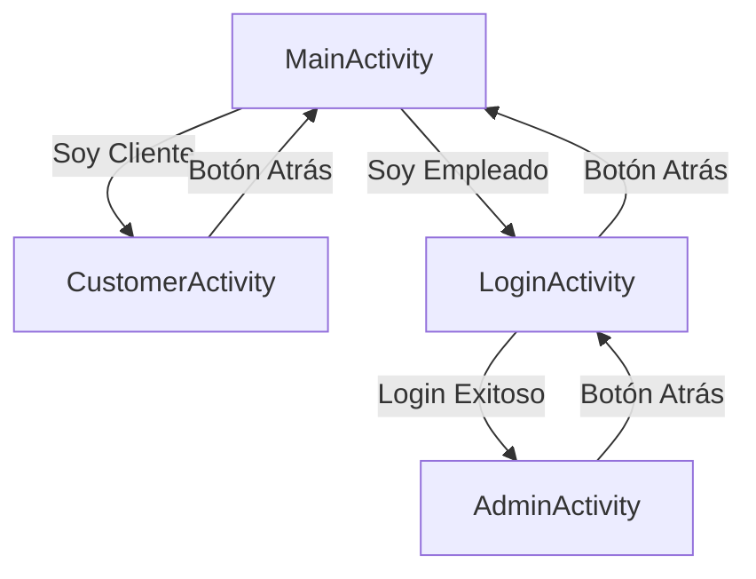

# Documentación Técnica - Turno Fácil

## Índice
1. [Información General](#información-general)
2. [Arquitectura del Sistema](#arquitectura-del-sistema)
3. [Requisitos del Sistema](#requisitos-del-sistema)
4. [Estructura del Proyecto](#estructura-del-proyecto)
5. [Componentes Principales](#componentes-principales)
6. [Flujo de Navegación](#flujo-de-navegación)
7. [Modelo de Base de Datos](#modelo-de-base-de-datos)
8. [Características Implementadas](#características-implementadas)
9. [Configuración del Proyecto](#configuración-del-proyecto)
10. [Guía de Compilación](#guía-de-compilación)
11. [Internacionalización](#internacionalización)
12. [Mejoras Futuras](#mejoras-futuras)

---

## Información General

### Descripción del Proyecto
**Turno Fácil** es una aplicación móvil Android diseñada para gestionar turnos de forma eficiente en establecimientos que requieren organización de filas de espera, como bancos, consultorios médicos, oficinas gubernamentales, etc.

### Datos del Proyecto
- **Nombre de la aplicación:** Turno Fácil
- **Package:** com.example.turnofacil
- **Versión:** 1.0
- **Lenguaje de programación:** Kotlin
- **Plataforma:** Android
- **SDK mínimo:** Android 7.0 (API 24)
- **SDK objetivo:** Android 14+ (API 36)

### Propósito
Facilitar la gestión de turnos tanto para clientes que necesitan esperar su turno como para empleados/administradores que gestionan el flujo de atención.

---

## Arquitectura del Sistema

### Patrón de Diseño
La aplicación sigue una arquitectura de **Activities** simple, apropiada para su alcance actual:

```
MainActivity (Pantalla Principal)
    ├── CustomerActivity (Módulo de Cliente)
    └── LoginActivity (Autenticación)
            └── AdminActivity (Panel de Administración)
```

### Componentes de la Arquitectura

1. **Capa de Presentación (UI):**
   - Activities para cada pantalla
   - Layouts XML con ConstraintLayout
   - Material Design Components

2. **Capa de Lógica de Negocio:**
   - Actualmente implementada dentro de cada Activity
   - Gestión de navegación entre pantallas
   - Control de idiomas (i18n)

3. **Capa Base:**
   - `BaseActivity`: Clase base que proporciona funcionalidad común

---

## Requisitos del Sistema

### Requisitos de Hardware
- Dispositivo Android con al menos 2GB de RAM
- 50MB de espacio de almacenamiento disponible
- Pantalla táctil

### Requisitos de Software
- Sistema Operativo: Android 7.0 (Nougat) o superior
- Android SDK 36
- Java 11 o superior

### Herramientas de Desarrollo
- **IDE:** Android Studio (versión recomendada: Hedgehog o superior)
- **Build System:** Gradle 8.x
- **Lenguaje:** Kotlin 1.9+
- **Plugins Gradle:**
  - Android Application Plugin
  - Kotlin Android Plugin

---

## Estructura del Proyecto

```
redes/
├── app/
│   ├── src/
│   │   ├── main/
│   │   │   ├── java/com/example/turnofacil/
│   │   │   │   ├── MainActivity.kt           # Pantalla principal
│   │   │   │   ├── BaseActivity.kt           # Actividad base
│   │   │   │   ├── LoginActivity.kt          # Autenticación
│   │   │   │   ├── AdminActivity.kt          # Panel de administrador
│   │   │   │   └── CustomerActivity.kt       # Panel de cliente
│   │   │   ├── res/
│   │   │   │   ├── layout/                   # Diseños de interfaz
│   │   │   │   ├── values/                   # Recursos (español)
│   │   │   │   ├── values-en/                # Recursos (inglés)
│   │   │   │   ├── drawable/                 # Iconos e imágenes
│   │   │   │   └── mipmap-*/                 # Iconos de launcher
│   │   │   └── AndroidManifest.xml           # Manifiesto de la app
│   │   ├── androidTest/                      # Tests instrumentados
│   │   └── test/                             # Tests unitarios
│   ├── build.gradle.kts                      # Configuración de módulo
│   └── proguard-rules.pro                    # Reglas de ofuscación
├── gradle/
│   ├── libs.versions.toml                    # Catálogo de versiones
│   └── wrapper/                              # Gradle Wrapper
├── build.gradle.kts                          # Configuración del proyecto
├── settings.gradle.kts                       # Configuración de módulos
└── README.md                                 # Documentación básica
```

---

## Componentes Principales

### 1. MainActivity
**Ubicación:** `app/src/main/java/com/example/turnofacil/MainActivity.kt`

**Propósito:** Pantalla principal que actúa como punto de entrada de la aplicación.

**Funcionalidades:**
- Presenta dos opciones de acceso: Cliente y Empleado
- Botón para cambiar el idioma de la aplicación
- Navegación hacia `CustomerActivity` o `LoginActivity`

**Métodos principales:**
```kotlin
onCreate(): Inicializa la vista y configura los listeners
setLocale(languageCode: String): Cambia el idioma de la aplicación
```

**Componentes UI:**
- `buttonCustomer`: Botón para acceso como cliente
- `buttonEmployee`: Botón para acceso como empleado
- `buttonChangeLanguage`: Botón para cambiar idioma

---

### 2. BaseActivity
**Ubicación:** `app/src/main/java/com/example/turnofacil/BaseActivity.kt`

**Propósito:** Clase abstracta que proporciona funcionalidad común a todas las actividades.

**Funcionalidades:**
- Implementa el comportamiento del botón "Atrás" en la ActionBar
- Manejo unificado de la navegación hacia atrás

**Herencia:**
```
AppCompatActivity
    └── BaseActivity
            ├── MainActivity
            ├── LoginActivity
            └── AdminActivity
```

---

### 3. LoginActivity
**Ubicación:** `app/src/main/java/com/example/turnofacil/LoginActivity.kt`

**Propósito:** Pantalla de autenticación para empleados/administradores.

**Funcionalidades:**
- Captura credenciales de inicio de sesión
- Validación de acceso (pendiente de implementar)
- Navegación hacia `AdminActivity` tras autenticación exitosa
- Botón "Atrás" habilitado en la ActionBar

**Estado actual:**
- La lógica de validación está pendiente de implementación
- Actualmente permite acceso directo sin validación

---

### 4. AdminActivity
**Ubicación:** `app/src/main/java/com/example/turnofacil/AdminActivity.kt`

**Propósito:** Panel de control para administradores del sistema de turnos.

**Funcionalidades:**
- Gestión de turnos activos
- Llamar al siguiente turno
- Cancelar turnos
- Botón "Atrás" habilitado

**Componentes UI (según layout):**
- Botón para llamar al siguiente turno
- Botón para cancelar turno actual
- Área de visualización de información

---

### 5. CustomerActivity
**Ubicación:** `app/src/main/java/com/example/turnofacil/CustomerActivity.kt`

**Propósito:** Interfaz para clientes que solicitan o consultan su turno.

**Funcionalidades:**
- Generación de ticket de turno
- Visualización del número de turno asignado
- Muestra tiempo estimado de espera
- Información sobre el mostrador de atención

**Componentes UI (según layout):**
- Botón para generar ticket
- Visualización del número de turno
- Tiempo estimado de espera
- Información adicional

---

## Flujo de Navegación



### Descripción del Flujo

1. **Inicio de la Aplicación:**
   - La app inicia en `MainActivity`
   - Usuario elige entre "Soy Cliente" o "Soy Empleado"

2. **Flujo de Cliente:**
   - Usuario selecciona "Soy Cliente"
   - Navegación a `CustomerActivity`
   - Usuario puede generar un ticket
   - Puede regresar a la pantalla principal

3. **Flujo de Empleado/Administrador:**
   - Usuario selecciona "Soy Empleado"
   - Navegación a `LoginActivity`
   - Usuario ingresa credenciales
   - Tras autenticación, accede a `AdminActivity`
   - Puede gestionar turnos
   - Puede regresar usando el botón "Atrás"

---

## Modelo de Base de Datos

La aplicación está diseñada para funcionar con una base de datos relacional que almacena la información de usuarios, turnos y notificaciones. A continuación se describe el esquema de base de datos propuesto.

### Diagrama Entidad-Relación

```
┌─────────────────┐         ┌─────────────────┐         ┌──────────────────┐
│    usuarios     │         │     turnos      │         │  notificaciones  │
├─────────────────┤         ├─────────────────┤         ├──────────────────┤
│ id (PK)         │────┐    │ id (PK)         │         │ id (PK)          │
│ nombre          │    │    │ id_usuario (FK) │◄────┐   │ id_usuario (FK)  │
│ email (UNIQUE)  │    └───►│ numero_turno    │     │   │ titulo           │
│ password        │         │ estado          │     │   │ mensaje          │
│ rol             │         │ fecha_hora      │     │   │ leida            │
│ fecha_registro  │         │ fecha_creacion  │     │   │ fecha_envio      │
└─────────────────┘         └─────────────────┘     │   └──────────────────┘
                                                     │
                                                     └───────────────────────┘
```

### 1. Tabla: usuarios

Almacena la información de cada persona que usa el sistema (cliente o administrador).

| Campo            | Tipo                     | Restricciones | Descripción                     |
|------------------|--------------------------|---------------|---------------------------------|
| `id`             | INT                      | PK, AI        | Identificador único del usuario |
| `nombre`         | VARCHAR(100)             | NOT NULL      | Nombre completo del usuario     |
| `email`          | VARCHAR(255)             | UNIQUE, NOT NULL | Correo electrónico único     |
| `password`       | VARCHAR(255)             | NOT NULL      | Contraseña encriptada (hash)    |
| `rol`            | ENUM('cliente', 'admin') | NOT NULL      | Define los permisos del usuario |
| `fecha_registro` | DATETIME                 | DEFAULT CURRENT_TIMESTAMP | Fecha de registro en el sistema |

**Índices:**
- PRIMARY KEY: `id`
- UNIQUE INDEX: `email`
- INDEX: `rol` (para búsquedas por tipo de usuario)

**Consideraciones de seguridad:**
- El campo `password` debe almacenar hashes seguros (bcrypt, Argon2, etc.), nunca texto plano
- El email debe validarse antes de insertarse
- Implementar rate limiting para intentos de login

---

### 2. Tabla: turnos

Registra los turnos agendados o generados por los clientes.

| Campo            | Tipo                                            | Restricciones | Descripción                           |
|------------------|-------------------------------------------------|---------------|---------------------------------------|
| `id`             | INT                                             | PK, AI        | Identificador único del turno         |
| `id_usuario`     | INT                                             | FK, NOT NULL  | Cliente que reservó/generó el turno   |
| `numero_turno`   | VARCHAR(50)                                     | NOT NULL      | Código del turno (ej: "A12", "B05")   |
| `estado`         | ENUM('pendiente', 'cancelado', 'completado')    | NOT NULL      | Estado actual del turno               |
| `fecha_hora`     | DATETIME                                        | NOT NULL      | Fecha y hora programada del turno     |
| `fecha_creacion` | DATETIME                                        | DEFAULT CURRENT_TIMESTAMP | Cuándo se creó el turno      |

**Relaciones:**
- FOREIGN KEY: `id_usuario` REFERENCES `usuarios(id)` ON DELETE CASCADE

**Índices:**
- PRIMARY KEY: `id`
- FOREIGN KEY INDEX: `id_usuario`
- INDEX: `estado` (para filtrar turnos activos)
- INDEX: `fecha_hora` (para ordenar por tiempo)
- UNIQUE INDEX: `numero_turno, fecha_hora` (evitar duplicados)

**Lógica de negocio:**
- El `numero_turno` debe generarse automáticamente según un algoritmo definido
- Los turnos en estado 'pendiente' deben ser procesables por el administrador
- Los turnos 'completado' o 'cancelado' son históricos

---

### 3. Tabla: notificaciones

Almacena las notificaciones enviadas a los usuarios del sistema.

| Campo             | Tipo                  | Restricciones | Descripción                     |
|-------------------|-----------------------|---------------|---------------------------------|
| `id`              | INT                   | PK, AI        | Identificador único             |
| `id_usuario`      | INT                   | FK, NOT NULL  | Usuario destinatario            |
| `titulo`          | VARCHAR(100)          | NOT NULL      | Título breve de la notificación |
| `mensaje`         | VARCHAR(255)          | NOT NULL      | Contenido del mensaje           |
| `leida`           | BOOLEAN               | DEFAULT 0     | Indica si fue leída (0=no, 1=sí)|
| `fecha_envio`     | DATETIME              | DEFAULT CURRENT_TIMESTAMP | Timestamp del envío    |

**Relaciones:**
- FOREIGN KEY: `id_usuario` REFERENCES `usuarios(id)` ON DELETE CASCADE

**Índices:**
- PRIMARY KEY: `id`
- FOREIGN KEY INDEX: `id_usuario`
- INDEX: `leida, id_usuario` (consultas de notificaciones no leídas)
- INDEX: `fecha_envio` (ordenar por recientes)

**Casos de uso:**
- Notificar cuando está próximo el turno del cliente
- Avisar si un turno fue cancelado
- Recordatorios automáticos
- Mensajes del administrador

---

### Diagrama de Relaciones Completo

```sql
-- Tabla usuarios
CREATE TABLE usuarios (
    id INT AUTO_INCREMENT PRIMARY KEY,
    nombre VARCHAR(100) NOT NULL,
    email VARCHAR(255) NOT NULL UNIQUE,
    password VARCHAR(255) NOT NULL,
    rol ENUM('cliente', 'admin') NOT NULL,
    fecha_registro DATETIME DEFAULT CURRENT_TIMESTAMP,
    INDEX idx_rol (rol),
    INDEX idx_email (email)
) ENGINE=InnoDB DEFAULT CHARSET=utf8mb4 COLLATE=utf8mb4_unicode_ci;

-- Tabla turnos
CREATE TABLE turnos (
    id INT AUTO_INCREMENT PRIMARY KEY,
    id_usuario INT NOT NULL,
    numero_turno VARCHAR(50) NOT NULL,
    estado ENUM('pendiente', 'cancelado', 'completado') NOT NULL DEFAULT 'pendiente',
    fecha_hora DATETIME NOT NULL,
    fecha_creacion DATETIME DEFAULT CURRENT_TIMESTAMP,
    FOREIGN KEY (id_usuario) REFERENCES usuarios(id) ON DELETE CASCADE,
    INDEX idx_usuario (id_usuario),
    INDEX idx_estado (estado),
    INDEX idx_fecha (fecha_hora),
    UNIQUE KEY uk_turno_fecha (numero_turno, fecha_hora)
) ENGINE=InnoDB DEFAULT CHARSET=utf8mb4 COLLATE=utf8mb4_unicode_ci;

-- Tabla notificaciones
CREATE TABLE notificaciones (
    id INT AUTO_INCREMENT PRIMARY KEY,
    id_usuario INT NOT NULL,
    titulo VARCHAR(100) NOT NULL,
    mensaje VARCHAR(255) NOT NULL,
    leida BOOLEAN DEFAULT FALSE,
    fecha_envio DATETIME DEFAULT CURRENT_TIMESTAMP,
    FOREIGN KEY (id_usuario) REFERENCES usuarios(id) ON DELETE CASCADE,
    INDEX idx_usuario_leida (id_usuario, leida),
    INDEX idx_fecha (fecha_envio)
) ENGINE=InnoDB DEFAULT CHARSET=utf8mb4 COLLATE=utf8mb4_unicode_ci;
```

---

### Consideraciones de Implementación

#### Backend Recomendado
Para implementar este modelo de base de datos, se recomienda:

1. **Base de datos:** MySQL 8.0+ o PostgreSQL 13+
2. **ORM:** Room (Android nativo) o Retrofit + API REST
3. **API Backend:** 
   - Spring Boot (Java/Kotlin)
   - Node.js + Express
   - Laravel (PHP)
   - Django/FastAPI (Python)

#### Sincronización con la App Android

La app Android actualmente no tiene implementada la persistencia de datos. Para integrar la base de datos:

**Opción 1: SQLite Local (sin servidor)**
```kotlin
// Usar Room Database
@Database(entities = [Usuario::class, Turno::class, Notificacion::class], version = 1)
abstract class AppDatabase : RoomDatabase() {
    abstract fun usuarioDao(): UsuarioDao
    abstract fun turnoDao(): TurnoDao
    abstract fun notificacionDao(): NotificacionDao
}
```

**Opción 2: API REST (recomendado)**
```kotlin
// Usar Retrofit para comunicación con backend
interface TurnoApiService {
    @GET("turnos/usuario/{id}")
    suspend fun getTurnosUsuario(@Path("id") userId: Int): List<Turno>
    
    @POST("turnos")
    suspend fun crearTurno(@Body turno: Turno): Response<Turno>
    
    @PUT("turnos/{id}/estado")
    suspend fun actualizarEstado(@Path("id") turnoId: Int, @Body estado: String): Response<Void>
}
```

#### Seguridad de Datos

1. **Autenticación:** Implementar JWT (JSON Web Tokens)
2. **Encriptación:** HTTPS obligatorio para todas las comunicaciones
3. **Validación:** Sanitizar todas las entradas de usuario
4. **Respaldos:** Backups automáticos diarios de la base de datos
5. **Logs:** Auditoría de acciones críticas (creación/cancelación de turnos)

#### Optimizaciones

- **Caché:** Implementar caché local para turnos activos
- **Paginación:** Para listas largas de turnos históricos
- **Índices:** Ya definidos en el esquema SQL
- **Pooling de conexiones:** Para múltiples usuarios concurrentes
- **Cleanup automático:** Eliminar turnos antiguos (>90 días) periódicamente

---

## Características Implementadas

### 1. Sistema de Navegación
- ✅ Navegación entre pantallas usando Intents
- ✅ Botón "Atrás" funcional en todas las pantallas secundarias
- ✅ Estructura de navegación clara y lógica

### 2. Internacionalización (i18n)
- ✅ Soporte para español (predeterminado)
- ✅ Soporte para inglés
- ✅ Cambio de idioma en tiempo de ejecución
- ✅ Persistencia del idioma seleccionado

### 3. Interfaz de Usuario
- ✅ Diseño Material Design
- ✅ Layouts responsivos con ConstraintLayout
- ✅ Iconos vectoriales para mejor escalabilidad
- ✅ Tema claro/oscuro mediante themes.xml

### 4. Estructura de Código
- ✅ Separación de responsabilidades
- ✅ Clase base para funcionalidad compartida
- ✅ Uso de Kotlin como lenguaje moderno
- ✅ Nomenclatura clara y consistente

---

## Configuración del Proyecto

### Archivo build.gradle.kts (Módulo app)

```kotlin
android {
    namespace = "com.example.turnofacil"
    compileSdk = 36
    
    defaultConfig {
        applicationId = "com.example.turnofacil"
        minSdk = 24
        targetSdk = 36
        versionCode = 1
        versionName = "1.0"
    }
    
    compileOptions {
        sourceCompatibility = JavaVersion.VERSION_11
        targetCompatibility = JavaVersion.VERSION_11
    }
    
    kotlinOptions {
        jvmTarget = "11"
    }
}
```

### Dependencias Principales

| Dependencia | Versión | Propósito |
|------------|---------|-----------|
| androidx.core:core-ktx | Variable | Extensiones Kotlin para Android |
| androidx.appcompat | Variable | Compatibilidad hacia atrás |
| material | Variable | Material Design Components |
| androidx.constraintlayout | Variable | Sistema de layouts flexible |
| androidx.activity | Variable | Gestión de actividades |

### Permisos de la Aplicación
Actualmente, la aplicación no requiere permisos especiales en el `AndroidManifest.xml`.

---

## Guía de Compilación

### Prerrequisitos
1. Instalar Android Studio
2. Configurar Android SDK (API 24 - API 36)
3. Instalar JDK 11 o superior

### Pasos para Compilar

#### 1. Clonar el Proyecto
```bash
git clone <url-del-repositorio>
cd redes
```

#### 2. Abrir en Android Studio
- File > Open
- Seleccionar la carpeta `redes`
- Esperar a que Gradle sincronice

#### 3. Compilar el Proyecto
```bash
./gradlew build
```

O desde Android Studio:
- Build > Make Project (Ctrl+F9)

#### 4. Ejecutar en Emulador/Dispositivo
- Seleccionar dispositivo de destino
- Run > Run 'app' (Shift+F10)

#### 5. Generar APK
```bash
./gradlew assembleDebug
```
El APK se generará en: `app/build/outputs/apk/debug/`

#### 6. Generar APK de Release
```bash
./gradlew assembleRelease
```

### Comandos Útiles de Gradle

```bash
# Limpiar el proyecto
./gradlew clean

# Ver todas las tareas disponibles
./gradlew tasks

# Ejecutar tests unitarios
./gradlew test

# Ejecutar tests instrumentados
./gradlew connectedAndroidTest

# Generar reporte de dependencias
./gradlew dependencies
```

---

## Internacionalización

### Idiomas Soportados
- **Español (es):** Idioma predeterminado
- **Inglés (en):** Idioma secundario

### Estructura de Recursos

#### Español (values/strings.xml)
```xml
<string name="app_name">Turno Fácil</string>
<string name="slogan">Gestiona turnos de forma eficiente</string>
<string name="button_customer">Soy Cliente</string>
<string name="button_employee">Soy Empleado</string>
```

#### Inglés (values-en/strings.xml)
```xml
<string name="app_name">Easy Turn</string>
<string name="slogan">Manage turns efficiently</string>
<string name="button_customer">I am a Customer</string>
<string name="button_employee">I am an Employee</string>
```

### Implementación del Cambio de Idioma

La aplicación permite cambiar el idioma en tiempo de ejecución mediante el método `setLocale()` en `MainActivity`:

```kotlin
private fun setLocale(languageCode: String) {
    val locale = Locale(languageCode)
    Locale.setDefault(locale)
    val config = Configuration()
    config.setLocale(locale)
    baseContext.resources.updateConfiguration(config, 
                                               baseContext.resources.displayMetrics)
    recreate()
}
```

### Agregar Nuevos Idiomas

Para agregar soporte para un nuevo idioma (por ejemplo, francés):

1. Crear carpeta `values-fr/` en `res/`
2. Copiar `strings.xml` y traducir los textos
3. El sistema Android seleccionará automáticamente el idioma según la configuración del dispositivo

---

## Mejoras Futuras

### Funcionalidades Pendientes

#### 1. Backend e Integración
- [ ] Implementar servicio backend (REST API o Firebase)
- [ ] Autenticación real de usuarios (JWT)
- [x] Diseño del esquema de base de datos (completado)
- [ ] Implementación de la base de datos (MySQL/PostgreSQL)
- [ ] Integración de Room Database para caché local
- [ ] Sincronización en tiempo real entre app y servidor
- [ ] API REST para gestión de turnos y usuarios

#### 2. Funcionalidad de Negocio
- [ ] Algoritmo de asignación de turnos
- [ ] Notificaciones push cuando se acerca el turno
- [ ] Sistema de prioridades (turnos preferenciales)
- [ ] Estadísticas y reportes de atención
- [ ] Gestión de múltiples servicios/ventanillas
- [ ] Cancelación de turnos por parte del cliente

#### 3. Mejoras de UI/UX
- [ ] Animaciones de transición entre pantallas
- [ ] Feedback visual mejorado (SnackBars, Toasts)
- [ ] Modo oscuro completo personalizado
- [ ] Temas personalizables
- [ ] Accesibilidad mejorada (TalkBack)

#### 4. Arquitectura y Código
- [ ] Implementar arquitectura MVVM o MVI
- [ ] Usar ViewModel y LiveData
- [ ] Inyección de dependencias (Hilt/Koin)
- [ ] Repository pattern para datos
- [ ] Navigation Component para navegación
- [ ] Coroutines para operaciones asíncronas

#### 5. Testing
- [ ] Tests unitarios completos
- [ ] Tests de integración
- [ ] Tests UI con Espresso
- [ ] Cobertura de código >80%

#### 6. Seguridad
- [ ] Ofuscación de código (ProGuard/R8)
- [ ] Cifrado de datos sensibles
- [ ] Validación de entradas
- [ ] Protección contra ataques comunes

#### 7. Rendimiento
- [ ] Optimización de layouts
- [ ] Lazy loading de recursos
- [ ] Caché de datos
- [ ] Reducción del tamaño del APK

#### 8. Características Adicionales
- [ ] Código QR para tickets
- [ ] Estimación inteligente de tiempos de espera
- [ ] Integración con sistemas de pantalla externa
- [ ] Panel web para administradores
- [ ] Reserva de turnos anticipada
- [ ] Valoración del servicio recibido

---

## Mantenimiento y Soporte

### Actualización de Dependencias

Es recomendable mantener las dependencias actualizadas:

```bash
# Ver dependencias desactualizadas
./gradlew dependencyUpdates
```

### Logs y Debugging

Para debugging, Android Studio ofrece:
- Logcat para ver logs en tiempo real
- Android Profiler para análisis de rendimiento
- Layout Inspector para depurar layouts

### Versionado

El proyecto sigue Semantic Versioning (SemVer):
- **MAJOR.MINOR.PATCH** (1.0.0)
- Actualizar `versionCode` y `versionName` en build.gradle.kts

---

## Contacto y Contribuciones

### Información del Proyecto
- **Repositorio:** redes
- **Owner:** Giancarlo174
- **Branch principal:** main

### Guía para Contribuir

1. Fork del repositorio
2. Crear una rama para la feature: `git checkout -b feature/nueva-funcionalidad`
3. Commit de cambios: `git commit -m 'Agregar nueva funcionalidad'`
4. Push a la rama: `git push origin feature/nueva-funcionalidad`
5. Crear Pull Request

---

## Glosario

### Términos de Android
- **Activity:** Componente de Android que representa una pantalla
- **Intent:** Objeto para comunicación entre componentes
- **Layout:** Archivo XML que define la estructura de la UI
- **Gradle:** Sistema de automatización de builds
- **APK:** Android Package Kit (paquete instalable)
- **SDK:** Software Development Kit
- **i18n:** Internacionalización (18 letras entre 'i' y 'n')
- **Material Design:** Sistema de diseño de Google
- **ConstraintLayout:** Sistema de layout flexible y eficiente

### Términos de Base de Datos
- **PK (Primary Key):** Llave primaria, identificador único de un registro
- **FK (Foreign Key):** Llave foránea, establece relación entre tablas
- **AI (Auto Increment):** Incremento automático de valores numéricos
- **UNIQUE:** Restricción que garantiza valores únicos en una columna
- **INDEX:** Estructura que mejora la velocidad de búsqueda en tablas
- **CASCADE:** Propaga operaciones (DELETE/UPDATE) a registros relacionados
- **ENUM:** Tipo de dato que acepta solo valores predefinidos
- **ORM (Object-Relational Mapping):** Mapeo de objetos a tablas relacionales
- **Room:** Biblioteca de persistencia de Android sobre SQLite
- **JWT (JSON Web Token):** Estándar para tokens de autenticación seguros

### Términos de Arquitectura
- **API REST:** Interfaz de programación basada en HTTP
- **Backend:** Servidor que procesa lógica de negocio y datos
- **Frontend:** Interfaz de usuario (la app Android)
- **MVVM:** Model-View-ViewModel, patrón de arquitectura
- **Repository Pattern:** Patrón que abstrae el acceso a datos
- **Retrofit:** Cliente HTTP para Android/Java
- **Coroutines:** Programación asíncrona en Kotlin

---

## Licencia

_Pendiente de definir_

---

## Historial de Versiones

| Versión | Fecha | Cambios |
|---------|-------|---------|
| 1.1 | 11/11/2025 | Agregado modelo completo de base de datos con 3 tablas principales |
| 1.0 | 11/11/2025 | Versión inicial con funcionalidades básicas |

---

**Última actualización:** 11 de noviembre de 2025

**Autor:** Giancarlo174

**Documento elaborado por:** GitHub Copilot
